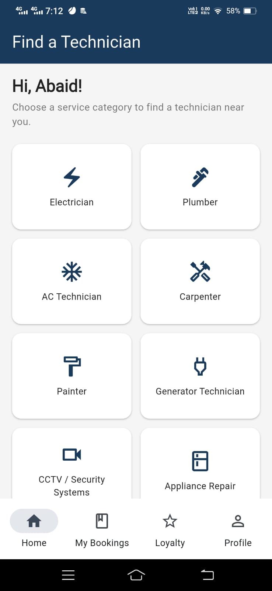
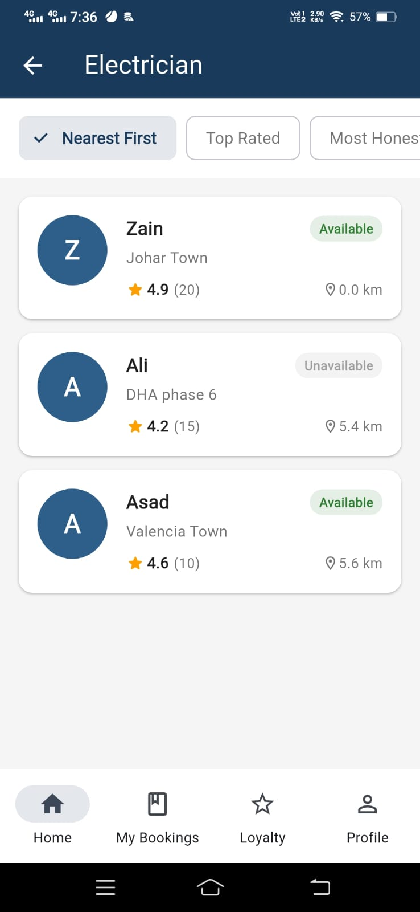
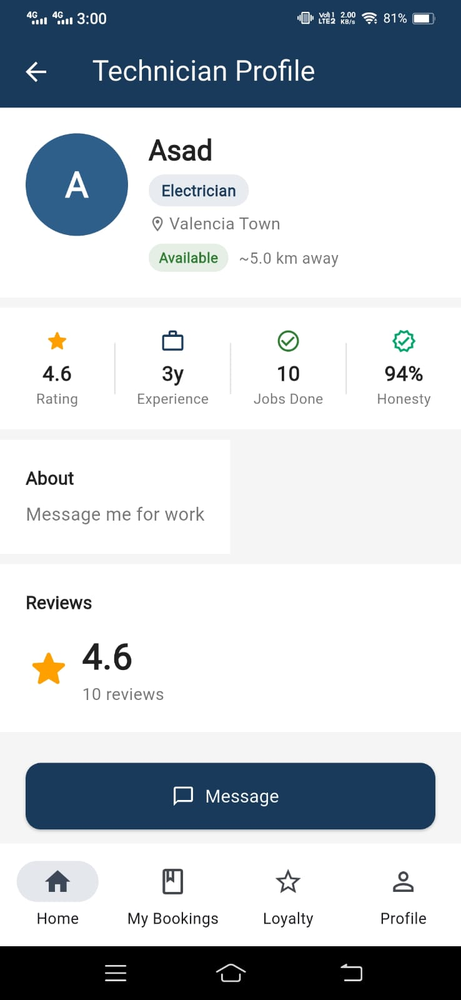
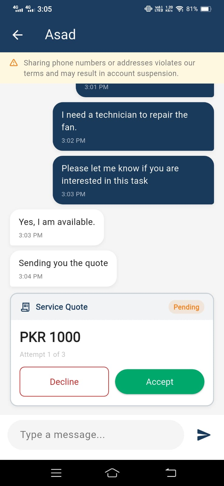
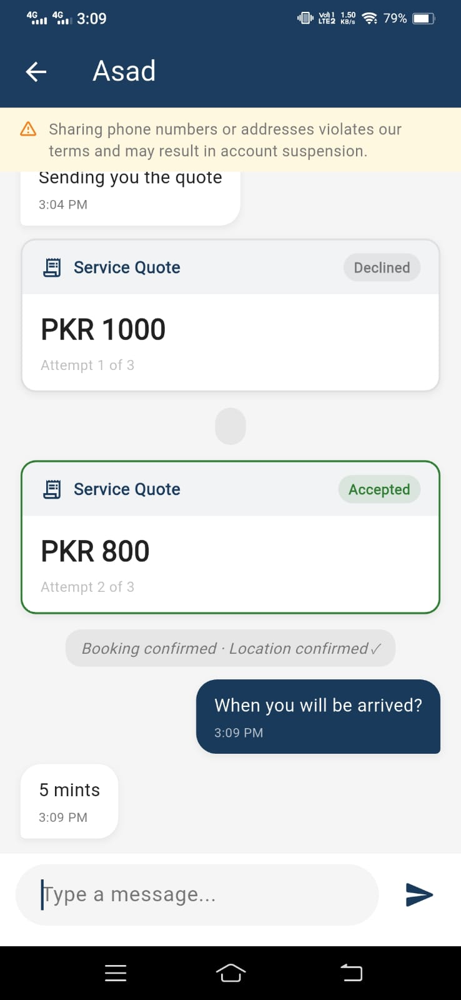
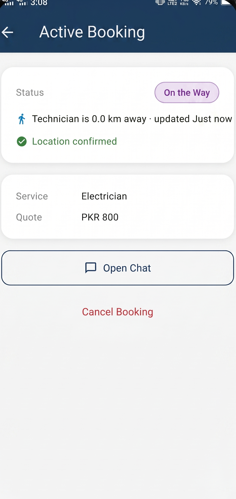
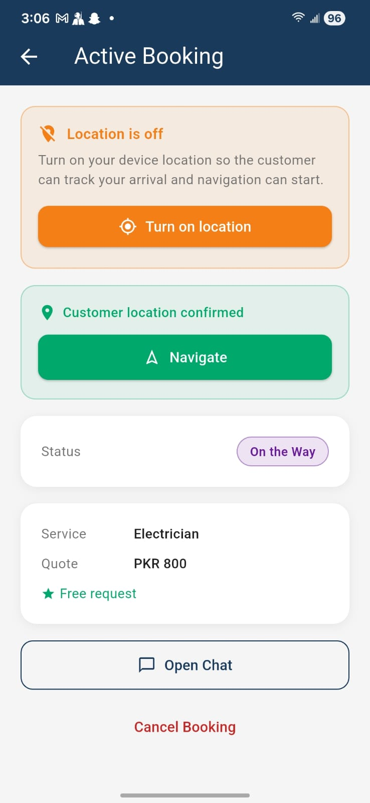

# Technician Finder — Two-Sided Service Marketplace

A two-sided Flutter marketplace connecting customers with home technicians 
across Pakistan. Customers can discover nearby technicians by service category, 
chat in real-time, negotiate quotes, and track live job progress — all while 
maintaining complete privacy between both parties.



---

## The Problem

Finding a reliable home technician in Pakistan typically means asking around 
on WhatsApp groups or relying on word-of-mouth — with no way to verify 
honesty, compare prices, or track someone's arrival. Technician Finder brings 
structure to this process: verified technician profiles, transparent quotes, 
honesty ratings, and real-time tracking.

---

## Key Features

- **Phone OTP authentication** for both customers and technicians
- **Location-based discovery** — find nearby technicians sorted by distance, rating, or availability
- **Privacy-first design** — phone numbers and addresses are never shared between parties
- **Real-time chat** with category-scoped conversation locking
- **Negotiable quote system** — up to 3 quote attempts per job with accept/decline
- **Live booking tracking** — real-time technician location updates for customers
- **Two-sided experience** — separate flows for customers and technicians
- **Honesty score** — technician reliability metric alongside ratings
- **Loyalty points system** — rewards based on completed bookings
- **Admin panel** — technician approvals, dispute resolution, revenue reporting

---

## Screenshots

### Home — Service Category Discovery


### Technician Results — Sorted by Distance & Availability


### Technician Profile — Rating, Experience & Honesty Score


### Chat & Quote — Negotiation in Progress


### Chat & Quote — Accepted & Booking Confirmed


### Active Booking — Customer Side Live Tracking


### Active Booking — Technician Side Navigation


---

## Tech Stack

| Layer | Technology |
|---|---|
| Frontend | Flutter (Dart) |
| State Management | Riverpod |
| Navigation | GoRouter |
| Backend | Firebase (Firestore, Auth, Cloud Functions v2, Storage) |
| Notifications | Firebase Cloud Messaging (FCM) |
| Admin Panel | Next.js, Node.js, TypeScript |

---

## How It Works

```text
Customer browses service categories
        ↓
Views nearby technicians (Haversine distance sorting)
        ↓
Opens chat with technician — phone numbers never revealed
        ↓
Technician sends quote (up to 3 attempts)
        ↓
Customer accepts → booking confirmed, location sharing begins
        ↓
Live tracking until job completion
        ↓
OTP-based job verification → payment & loyalty points awarded
```

---

## Notable Architecture Decisions

- **Privacy-first communication** — no phone numbers or addresses exchanged at any 
  stage, enforced via Cloud Functions
- **Category-scoped chat locking** — prevents conversation conflicts across 
  multiple active jobs
- **Standardized notification system** — 18 distinct event types with a 
  unified payload structure for consistent deep-linking
- **Commission-based wallet** — technicians maintain a wallet balance, 
  commission deducted on booking acceptance
- **Firestore transactions** — used throughout to prevent race conditions 
  during booking, quote, and wallet operations

---

## Current Status

 **Active Development**

Completed:
-  Authentication (OTP-based, customer & technician)
-  Location-based technician discovery
-  Real-time chat with quote system
-  Live booking tracking
-  Notification system (FCM)
-  Admin panel — approvals, disputes, revenue

In progress:
-  Additional booking flow refinements
-  Performance optimizations

---

## Note

This is an active business project under development. Source code is 
private and available upon request for academic or professional review.
